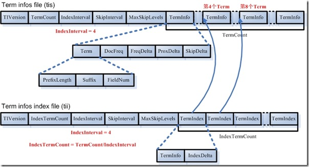
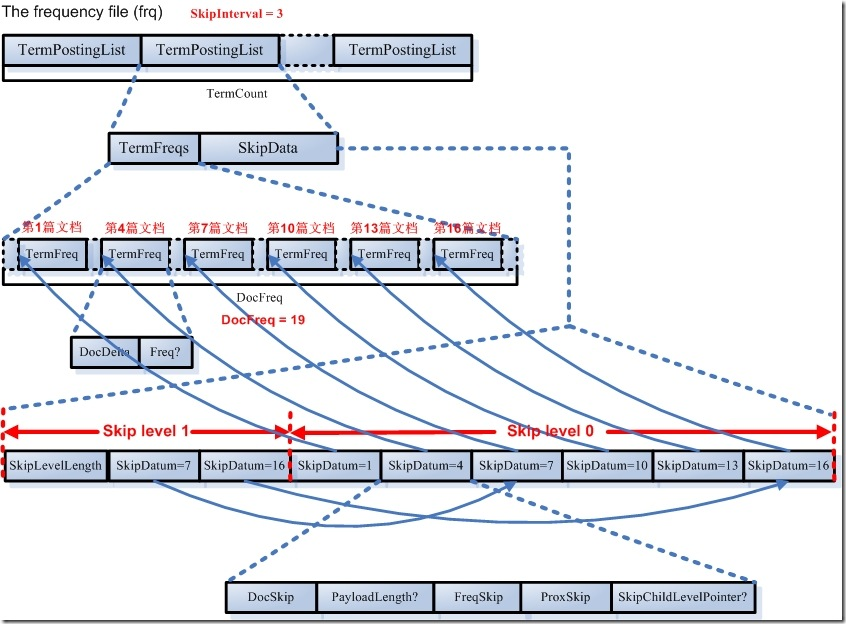
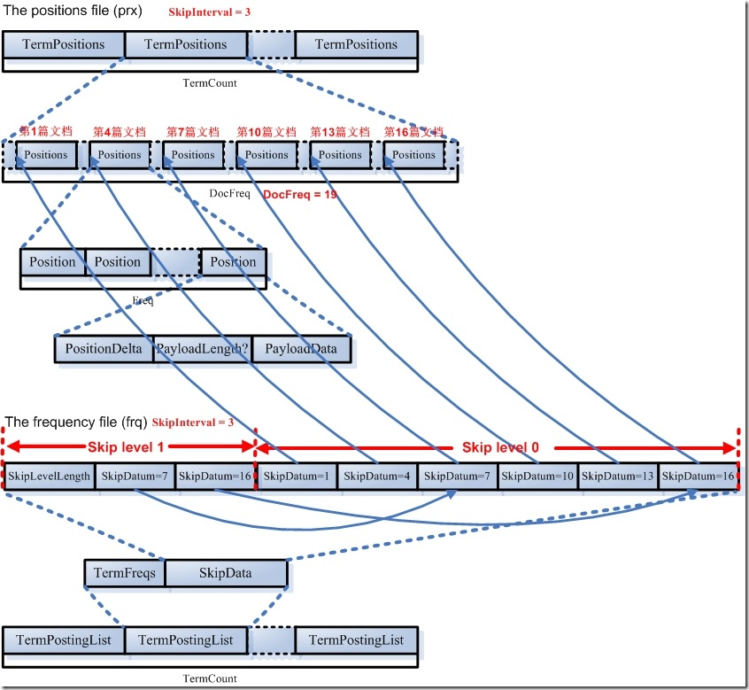

> http://www.cnblogs.com/forfuture1978/archive/2010/02/02/1661436.html

#### inverted index info.

词典(Term Dictionary)

    term infos index file:  .tii
    term infos file.        .tis

倒排表(Posting List)

    docId,term frequency:   .frq
    term position:          .prx

#### tii, tis file format

#### .tii AND .tis 文件格式解释

在词典中,所有的词是按照字典顺序排序的

- 词典文件(tis)
    - TermCount：    词典中包含的总的词数
    - IndexInterval：为了加快对词的查找速度，也应用类似跳跃表的结构，
        假设IndexInterval为4,则在词典索引(tii)文件中保存第4个,第8个,第12个词
        这样可以加快在词典文件中查找词的速度
    - SkipInterval： 倒排表无论是文档号及词频,还是位置信息,都是以跳跃表的结构存在的,SkipInterval是跳跃的步数
    - MaxSkipLevels：跳跃表是多层的,这个值指的是跳跃表的最大层数
    - TermCount个项的数组,每一项代表一个词,对于每一个词: 
        - 以前缀后缀规则存放词的文本信息(PrefixLength + Suffix),词属于的域的域号(FieldNum)
        - 有多少篇文档包含此词(DocFreq)
        - 此词的倒排表在frq,prx中的偏移量(FreqDelta,ProxDelta)
        - 此词的倒排表的跳跃表在frq中的偏移量(SkipDelta),这里之所以用Delta,是应用差值规则

- 词典索引文件(tii)
    - 为了加快对词典文件中词的查找速度,保存每隔IndexInterval个词
    - 词典索引文件是会被全部加载到内存中去的
    - IndexTermCount = TermCount / IndexInterval：词典索引文件中包含的词数
    - IndexInterval 同词典文件中的 IndexInterval
    - SkipInterval  同词典文件中的 SkipInterval
    - MaxSkipLevels 同词典文件中的 MaxSkipLevels
    - IndexTermCount 个项的数组,每一项代表一个词,每一项包括两部分:
        - 第一部分是词本身(TermInfo)
        - 第二部分是在词典文件中的偏移量(IndexDelta)
        - 假设IndexInterval为4,此数组中保存第4个,第8个,第12个词...

#### 代码实现简单理解

    lucene索引文件后缀常量类: IndexFileNames

    1.TermInfosReader构造器初始化
    2.TermInfosReader.get(Term term)调用入口

    实现逻辑:
    初始化: 
        读取.tis文件全部,.tii文件除了terminfo list;
    查下terminfo通过term: 
        先在lru缓存里查找
        再从.tii读出来的索引结构二分查找
        最后再从文件查找
    如果term很大,IndexInterval怎么平衡? 压测看看结果先
    考虑其他实现: hash, b tree这两种数据结构是搜素引擎字典构造推荐的结构,但是文件怎么存储?

##### 实现细节整理

    1.TermInfosWriter
    2.TermInfosReader

---

### .frq AND .prx文件格式

#### 文档号及词频(frq)信息

FormatPostingsPositionsWriter

#### 词位置(prx)信息

FormatPostingsPositionsWriter

